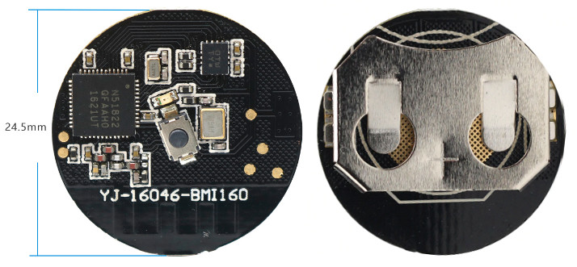

## SensiCoin

### What?

This repo provides the bases to explore room-level positioning (using RSSI) and motion sensing for activity analysis.

It uses an accelerometer, gyroscope (BMI160) and a BLE powered microcontroller (nRF51), all squeezed on a coin cell battery sized board:

The software provided is a simple Web BLE test using serial-like communication.

### How?

#### Firmware and Hardware

1) Get the hardware [here](https://www.aliexpress.com/item/nordic-NRF51822-Bluetooth-4-0-BLE-module-Gyro-sensor-BMI160/32867567010.html) (if the link dies [this archive](https://archive.is/aqcnv) should help to find a similare device).

2) Documentation/tuto: see the [firmware](./firmware) and [hardware](./hardware) folders.

#### Software (web app)

It was tested on Chrome/Chromium for now, and works on almost any OS (android too).

- Win/Linux, you might have to go to `chrome://flags/#enable-experimental-web-platform-features`, enable the highlighted flag, and restart Chrome for now.

- Ubuntu 16.04 users must update Bluez, [this tutorial](https://acassis.wordpress.com/2016/06/28/how-to-get-chrome-web-bluetooth-working-on-linux) should help.

- Other platforms: see the [Implementation Status](https://github.com/WebBluetoothCG/web-bluetooth/blob/master/implementation-status.md#implementation-status).

If everything works, you should be able to see a second counter once connected to your BLE device with this interface:

https://honnet.github.io/SensiCoin

### Credits

- nRF5x Arduino: [Sandeep Mistry](https://github.com/sandeepmistry/)

- Web BLE: [Chinmay Pendharkar](https://github.com/notthetup)

### Licence

[GNU General Public License version 3](https://opensource.org/licenses/GPL-3.0)

